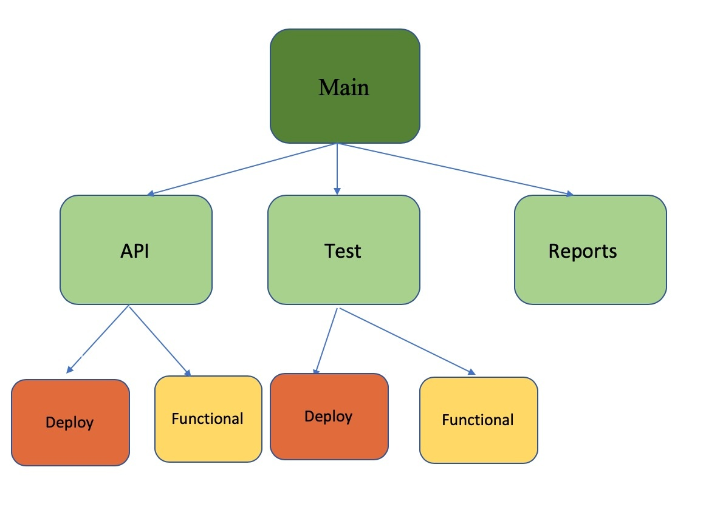

# Platform-qa
This framework can be used to deploy and test various Mobileiron components like Leo, Polaris, Capella etc. This framework makes use of AWS Cloudformation service to deploy the component as a whole along with all its instances and containers.



## Documentation

## Prerequisites
+ AWS access and secret keys with appropiate permissions
+ Docker Engine installed

## Running the tests

To get started, first clone the repository and make sure you can run the test suite.  If you're not familiar with Git, visit the [Git homepage](http://git-scm.com) to download Git for your platform.

First, clone the repository:
```
$ git clone git://github.com/platform_qa.git
$ cd platform_qa/main/tests
```
### Setting up Environment

Need to have Python 3 and necessary packages in requirements.txt installed.

### How to execute
With this framework we can do two major things
1. Deployment
2. Feature Test (superfically)

Below is the example way to deploy leo cluster
```
python3 leo.py --region <REGION> --stack-name <Stack_Name> --dbsnapshot-name <Leo_Snapshot> --leofilter-pattern 'MOBILEIRON-STATUS. OK'  --eip "<EIP0 EIP1 EIP2>" --domain-root <Domain_Name> create
```

## Guidelines for contribution
* Follow [PEP8](https://www.python.org/dev/peps/pep-0008/) standard while coding
* Create your own branch while working on code changes.
* Merge to master only after code review approval.

## Reporting Issues

## Contact

